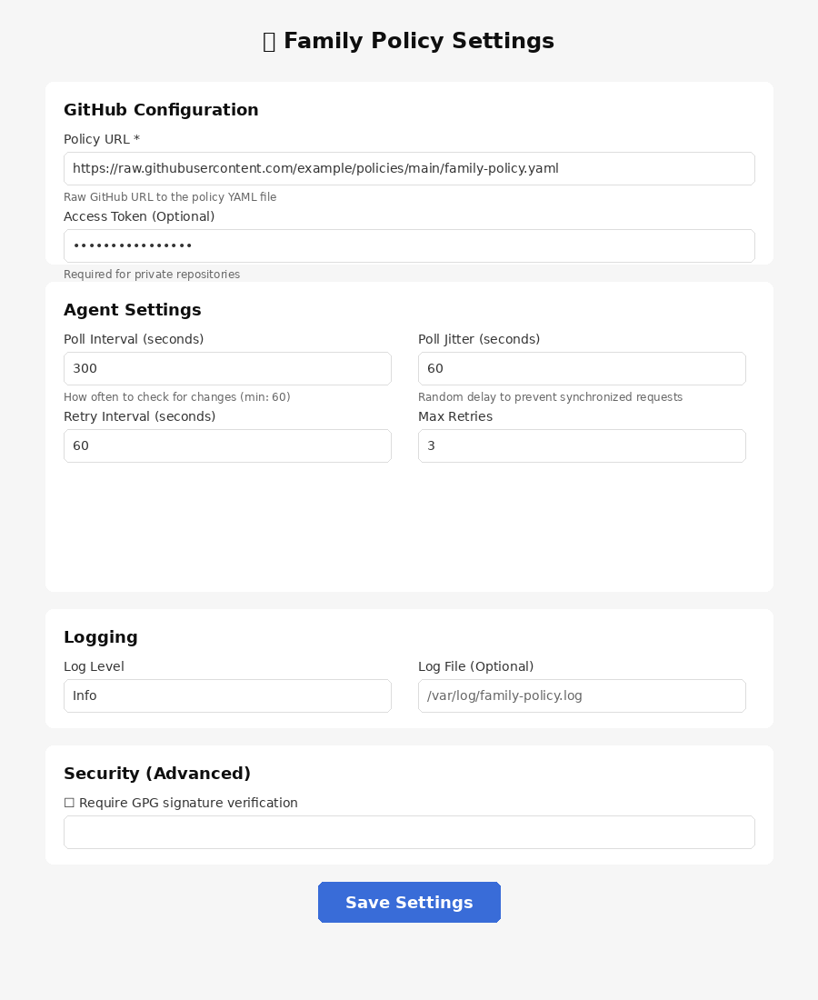
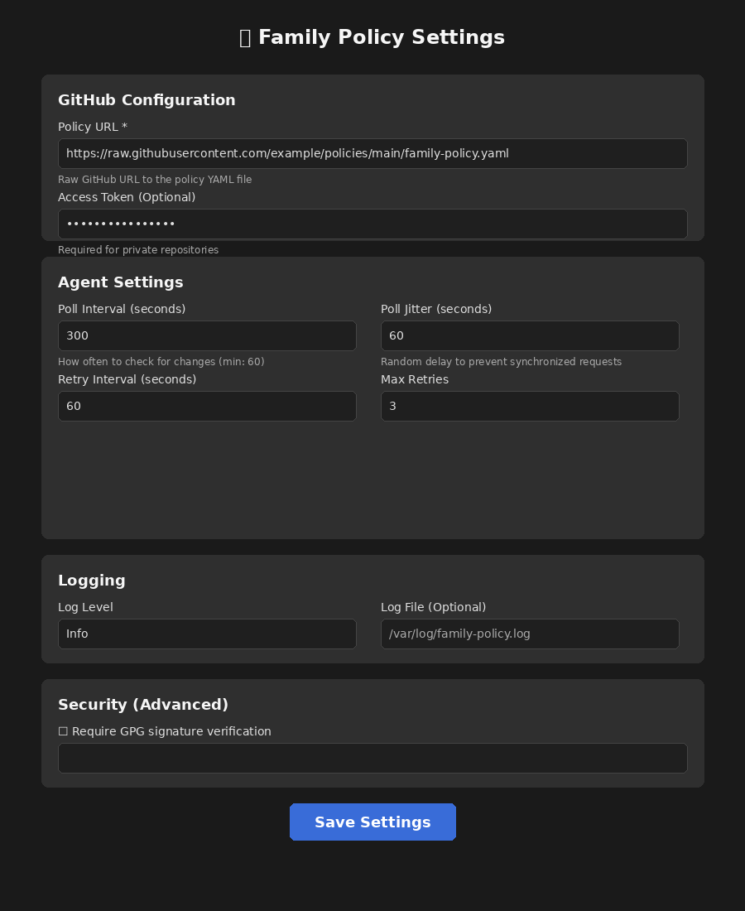

# Family Policy UI

A Tauri v2-based system tray application with Vue frontend for managing Family Policy agent settings.

## Screenshots

### System Tray Icon


The application sits in your system tray for easy access. Click the icon to open settings, or right-click for a menu with Settings and Quit options.

### Settings Window (Light Mode)


### Settings Window (Dark Mode)


The UI automatically adapts to your system's light or dark mode preference.

## Features

- **System Tray Icon**: Sits in the system tray for easy access
- **Admin-Only Settings**: Requires administrator privileges to modify configuration
- **Agent Configuration**: Manages GitHub polling, agent settings, logging, and security options
- **Cross-Platform**: Works on Windows, macOS, and Linux

## Prerequisites

Before building, ensure you have the required dependencies installed:

### Linux
```bash
sudo apt update
sudo apt install libwebkit2gtk-4.0-dev \
    build-essential \
    curl \
    wget \
    file \
    libssl-dev \
    libgtk-3-dev \
    libayatana-appindicator3-dev \
    librsvg2-dev \
    pango1.0-dev \
    libgdk-pixbuf2.0-dev \
    libsoup2.4-dev \
    libjavascriptcoregtk-4.0-dev
```

### macOS
```bash
# Install Xcode Command Line Tools
xcode-select --install
```

### Windows
- Install [Microsoft Visual Studio C++ Build Tools](https://visualstudio.microsoft.com/visual-cpp-build-tools/)
- Install [WebView2](https://developer.microsoft.com/en-us/microsoft-edge/webview2/)

## Development

### Install Dependencies
```bash
pnpm install
```

### Run in Development Mode
```bash
# Note: Requires admin/root privileges for config file access
sudo pnpm tauri dev
```

### Build for Production
```bash
pnpm tauri build
```

## Configuration

The UI manages the agent configuration file located at:
- **Linux**: `/etc/family-policy/agent.conf`
- **macOS**: `/Library/Application Support/family-policy/agent.conf`
- **Windows**: `C:\ProgramData\family-policy\agent.conf`

### Configuration Options

#### GitHub Settings
- **Policy URL** (required): HTTPS URL to raw GitHub policy YAML file
- **Access Token** (optional): GitHub personal access token for private repositories

#### Agent Settings
- **Poll Interval**: How often to check for policy updates (minimum 60 seconds)
- **Poll Jitter**: Random delay added to prevent synchronized requests
- **Retry Interval**: Delay between retry attempts on failure
- **Max Retries**: Maximum number of retry attempts

#### Logging
- **Log Level**: error, warn, info, debug, or trace
- **Log File**: Optional path to log file

#### Security
- **Require Signature**: Enable GPG signature verification (advanced)
- **Trusted Key**: GPG key fingerprint for verification

## Architecture

### Frontend (Vue + TypeScript)
- `src/App.vue`: Main settings UI component
- Form validation and admin privilege checking
- Responsive design with light/dark mode support

### Backend (Rust + Tauri)
- `src-tauri/src/lib.rs`: Main application logic with system tray
- `src-tauri/src/agent_config.rs`: Configuration management module
- Commands exposed to frontend:
  - `get_agent_config()`: Load current configuration
  - `save_agent_config(config)`: Save configuration (requires admin)
  - `check_admin_privileges()`: Check if running with admin rights

### System Tray
- Icon with right-click menu
- Menu items: Settings, Quit
- Left-click to open settings window
- Window hidden by default (typical systray behavior)

## Security

- **Admin Privileges Required**: Settings can only be saved with administrator/root privileges
- **Config File Permissions**: Configuration file is created with restrictive permissions (0600 on Unix)
- **HTTPS Only**: Policy URLs must use HTTPS protocol
- **Input Validation**: Form inputs are validated before saving

## Recommended IDE Setup

- [VS Code](https://code.visualstudio.com/) + [Vue - Official](https://marketplace.visualstudio.com/items?itemName=Vue.volar) + [Tauri](https://marketplace.visualstudio.com/items?itemName=tauri-apps.tauri-vscode) + [rust-analyzer](https://marketplace.visualstudio.com/items?itemName=rust-lang.rust-analyzer)

## License

MIT OR Apache-2.0
